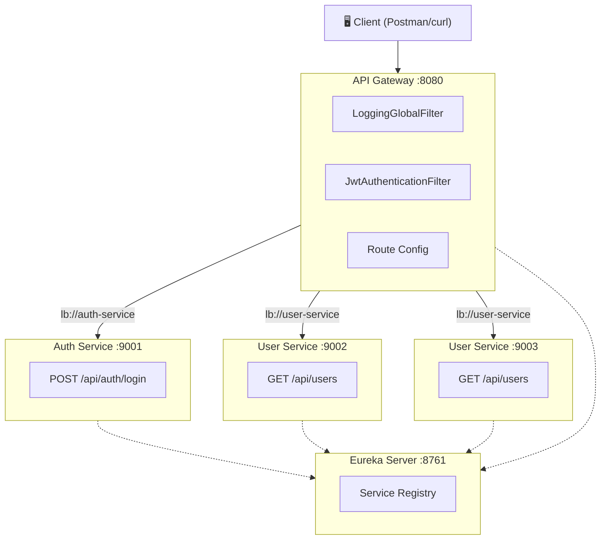

# 🎓 Spring Boot Microservices Demo

> University presentation demo — 4 services showcasing Service Discovery, API Gateway, JWT Authentication, and Load Balancing.

## Architecture Overview



## Project Structure

```
d:\PTPMHDV\
├── eureka-server/
│   ├── pom.xml
│   └── src/main/
│       ├── java/com/microservices/demo/eureka/
│       │   └── EurekaServerApplication.java
│       └── resources/
│           └── application.yml
│
├── api-gateway/
│   ├── pom.xml
│   └── src/main/
│       ├── java/com/microservices/demo/gateway/
│       │   ├── ApiGatewayApplication.java
│       │   ├── util/
│       │   │   └── JwtUtil.java
│       │   └── filter/
│       │       ├── JwtAuthenticationFilter.java
│       │       └── LoggingGlobalFilter.java
│       └── resources/
│           └── application.yml
│
├── auth-service/
│   ├── pom.xml
│   └── src/main/
│       ├── java/com/microservices/demo/auth/
│       │   ├── AuthServiceApplication.java
│       │   ├── controller/
│       │   │   └── AuthController.java
│       │   ├── dto/
│       │   │   ├── LoginRequest.java
│       │   │   └── LoginResponse.java
│       │   └── util/
│       │       └── JwtUtil.java
│       └── resources/
│           └── application.yml
│
└── user-service/
    ├── pom.xml
    └── src/main/
        ├── java/com/microservices/demo/user/
        │   ├── UserServiceApplication.java
        │   └── controller/
        │       └── UserController.java
        └── resources/
            └── application.yml
```

## Tech Stack

| Technology | Purpose |
|---|---|
| Java 17 | Language |
| Spring Boot 3.2.5 | Framework |
| Spring Cloud 2023.0.1 | Cloud support |
| Spring Cloud Gateway | API Gateway (reactive) |
| Netflix Eureka | Service Discovery |
| JJWT 0.12.5 | JWT token generation & validation |
| Maven | Build tool |

## 🚀 How to Run (Step by Step)

> [!IMPORTANT]
> **Start services in this exact order.** Eureka must be running before other services register.

### Prerequisites
- Java 17+ installed (`java -version`)
- Maven installed (`mvn -version`)

### Step 1: Start Eureka Server
```powershell
cd d:\PTPMHDV\eureka-server
mvn spring-boot:run
```
Wait until you see: `Started EurekaServerApplication`
Verify at: **http://localhost:8761**

### Step 2: Start Auth Service
```powershell
cd d:\PTPMHDV\auth-service
mvn spring-boot:run
```

### Step 3: Start User Service — Instance 1 (port 9002)
```powershell
cd d:\PTPMHDV\user-service
mvn spring-boot:run
```

### Step 4: Start User Service — Instance 2 (port 9003)
```powershell
cd d:\PTPMHDV\user-service
mvn spring-boot:run -Dspring-boot.run.arguments="--server.port=9003"
```

### Step 5: Start API Gateway
```powershell
cd d:\PTPMHDV\api-gateway
mvn spring-boot:run
```

> [!TIP]
> Open each service in a **separate terminal window**.

---

## 🧪 Testing (Postman or curl)

### 1. Login — Get JWT Token

```bash
curl -X POST http://localhost:8080/api/auth/login \
  -H "Content-Type: application/json" \
  -d '{"username": "admin", "password": "admin123"}'
```

**Expected Response:**
```json
{
  "token": "eyJhbGciOiJIUzM4NCJ9...",
  "username": "admin",
  "message": "Login successful!"
}
```

**Mock Users Available:**
| Username | Password |
|---|---|
| `admin` | `admin123` |
| `user` | `user123` |
| `demo` | `demo123` |

### 2. Access Users — Without Token (should fail)

```bash
curl http://localhost:8080/api/users
```

**Expected Response (401):**
```json
{
  "error": "Missing or invalid Authorization header",
  "status": 401
}
```

### 3. Access Users — With Valid Token

```bash
curl http://localhost:8080/api/users \
  -H "Authorization: Bearer <YOUR_TOKEN_HERE>"
```

**Expected Response:**
```json
{
  "message": "User list fetched successfully from port 9002",
  "serverPort": "9002",
  "users": [
    {"id": "1", "name": "Nguyen Van A", "email": "nguyenvana@example.com"},
    {"id": "2", "name": "Tran Thi B", "email": "tranthib@example.com"},
    {"id": "3", "name": "Le Van C", "email": "levanc@example.com"}
  ]
}
```

### 4. Demonstrate Load Balancing

Call the same endpoint multiple times:
```bash
curl http://localhost:8080/api/users -H "Authorization: Bearer <TOKEN>"
curl http://localhost:8080/api/users -H "Authorization: Bearer <TOKEN>"
curl http://localhost:8080/api/users -H "Authorization: Bearer <TOKEN>"
```

> [!TIP]
> Notice the `serverPort` alternating between **9002** and **9003** — this proves load balancing via Eureka is working!

---

## 🔑 Key Concepts for Presentation

### 1. Service Discovery (Eureka)
- All services register with Eureka Server at `http://localhost:8761`
- Gateway uses `lb://service-name` URIs for dynamic routing
- No hardcoded service URLs!

### 2. API Gateway Pattern
- Single entry point for all client requests (port 8080)
- Edge routing via path predicates
- Cross-cutting concerns (auth, logging) handled centrally

### 3. JWT Authentication
- Auth service generates JWT tokens (HS256 signing)
- Gateway validates tokens before forwarding requests
- Open endpoints (login) bypass authentication

### 4. Load Balancing
- Two instances of user-service run on different ports
- Gateway automatically distributes requests via Eureka
- `serverPort` in response proves which instance handled the request

### 5. Global Logging
- Every request through the gateway is logged
- Captures: HTTP method, path, response status, execution time (ms)

---

## Port Summary

| Service | Port(s) |
|---|---|
| Eureka Server | 8761 |
| API Gateway | 8080 |
| Auth Service | 9001 |
| User Service (Instance 1) | 9002 |
| User Service (Instance 2) | 9003 |
